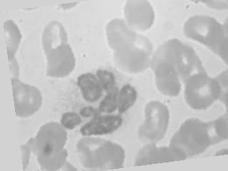
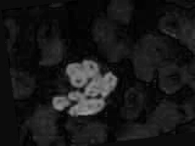

# cell_classify
使用tensorflow和caffe实现白细胞种类识别
# 数据集
https://www.kaggle.com/paultimothymooney/blood-cells#dataset2-master.zip
# 环境
win10 64位
python 3.5
tensorflow-gpu 1.7
cuda v9.0
# 图片预处理
处理前   

   
灰度图   

   

HSV空间S通道   

   
处理后   

